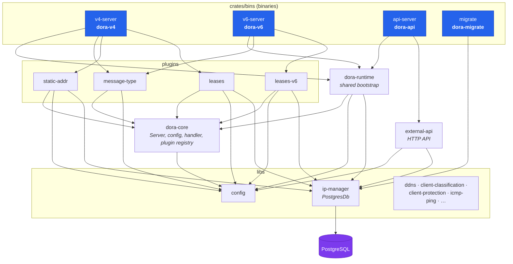
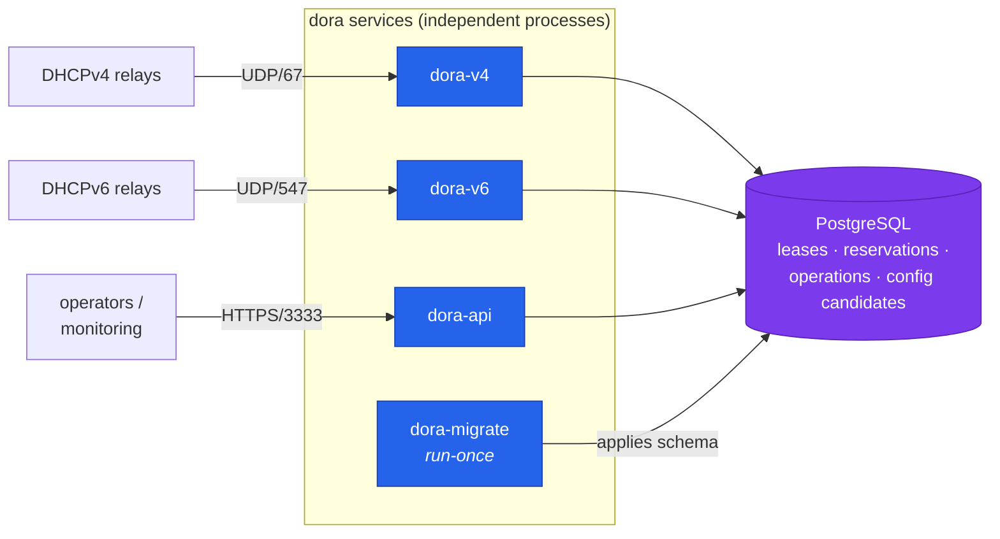
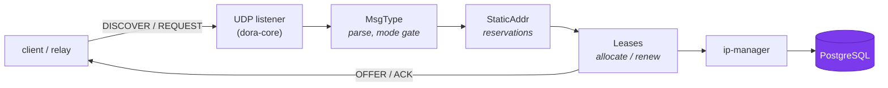
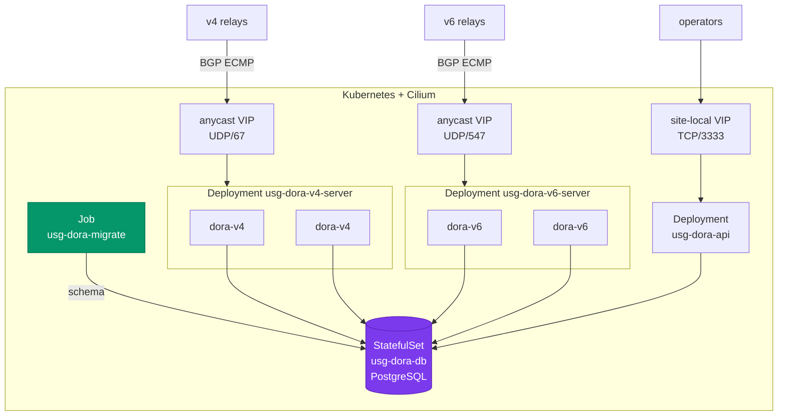

# dora architecture

dora is a DHCPv4/DHCPv6 server with a management/observability HTTP API. It runs
as a set of **independent microservices** — one binary and one container image per
role — that share a single PostgreSQL database. This document describes how those
pieces fit together, from crates to processes to a Kubernetes deployment.

- [Services at a glance](#services-at-a-glance)
- [Crate layout](#crate-layout)
- [Runtime topology](#runtime-topology)
- [Service startup](#service-startup)
- [DHCP request flow](#dhcp-request-flow)
- [Kubernetes deployment](#kubernetes-deployment)
- [Design notes](#design-notes)

## Services at a glance

| Service | Binary | Image | Owns |
| --- | --- | --- | --- |
| DHCPv4 server | `dora-v4` | `usg-dora-v4` | v4 datapath (`MsgType` → `StaticAddr` → `Leases`) |
| DHCPv6 server | `dora-v6` | `usg-dora-v6` | v6 datapath (`MsgType` → `LeasesV6`) |
| Management API | `dora-api` | `usg-dora-api` | health, metrics, mode, runtime reservations |
| Schema migrator | `dora-migrate` | `usg-dora-migrate` | run-once DB migrations |

All four are thin `main`s built on the shared [`dora-runtime`](../crates/dora-runtime)
library; the DHCP datapath itself lives in [`dora-core`](../crates/dora-core).

## Crate layout



Each service compiles only the crates its role needs, so the v4 image never links
the v6 plugins, the API image never links the datapath, and so on.

## Runtime topology

Every service is a separate process (and, in production, a separate pod). They do
not talk to each other directly — the **database is the only shared state**.



`dora-migrate` runs to completion **before** the servers start and then exits;
the servers connect assuming the schema already exists (they never migrate).

## Service startup

Each server shares the same bootstrap sequence from `dora-runtime`, then wires its
own role. The v4 server is shown; v6 is identical with the v6 plugin chain, and the
API skips the datapath entirely.

```mermaid
sequenceDiagram
    autonumber
    participant M as dora-migrate (Job)
    participant S as dora-v4 (main)
    participant RT as dora-runtime
    participant DB as PostgreSQL
    participant SRV as Server&lt;v4::Message&gt;

    M->>DB: apply migrations, exit 0
    Note over S,SRV: servers start only after migrate succeeds

    S->>RT: build_runtime(config)
    S->>RT: bootstrap(config)
    RT->>DB: PostgresDb::connect (no migrate)
    RT->>DB: list_reservations()
    DB-->>RT: reservation records
    RT-->>S: Shared { dhcp_cfg, ip_mgr, mode, reservations, token }
    S->>SRV: Server::new(config, v4 interfaces)
    S->>SRV: register MsgType, StaticAddr, Leases
    S->>SRV: start(shutdown_signal(token))
    Note over SRV: serving UDP until Ctrl-C or token cancel
```

## DHCP request flow

Inside a server, an incoming message runs through an ordered plugin chain managed
by `dora-core`. Each plugin can answer, mutate, or pass the message along.



The v6 server uses the same shape with `MsgType → LeasesV6`. `MsgType` consults the
API-managed **server mode** (normal / maintenance / drain) to decide whether to
answer at all.

## Kubernetes deployment

In the reference deployment ([`deploy/`](../deploy)), each service is its own
workload. The DHCP servers sit behind **Cilium anycast VIPs** (advertised over BGP);
the API gets a separate site-local VIP. A one-shot `Job` migrates the schema.



See [kubernetes_deploy.md](./kubernetes_deploy.md) and [deploy/README.md](../deploy/README.md)
for the full manifests, VIP wiring, and Cilium/BGP prerequisites.

## Design notes

- **Database is the coordination point.** The services never call each other. Leases,
  runtime reservations, operation/audit records, and config candidates all live in
  Postgres, which is how the separate v4/v6/api processes share state.
- **Mode & reservations are per-process in memory.** `SharedMode` and the in-memory
  `RuntimeReservations` are populated per process at startup (reservations are warm-
  loaded from the DB). A mode change made through the API does **not** propagate
  in-memory to the datapaths — this was already true for any role-split deployment
  and is out of scope for the split itself; durable coordination is via the DB.
- **Migrations are owned by `dora-migrate`.** Servers use `PostgresDb::connect`
  (non-migrating); only the migrator calls `PostgresDb::migrate`. This removes the
  startup race where multiple services/replicas would try to migrate the shared DB
  at once.
- **One binary per image.** The [`Containerfile`](../infra-build/Containerfile) is
  parameterized by a `SERVICE` build-arg (`v4|v6|api|migrate`) and bakes `DORA_BIN`;
  the entrypoint execs that binary and forwards flag args.
- **Tests spawn real binaries.** The [`integration-tests`](../crates/integration-tests)
  crate runs `dora-migrate` then spawns `dora-api` + `dora-v4` (and `dora-v6` for the
  relay test) as child processes, exercising the real split end-to-end.
